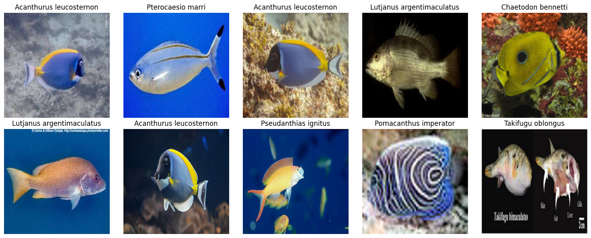
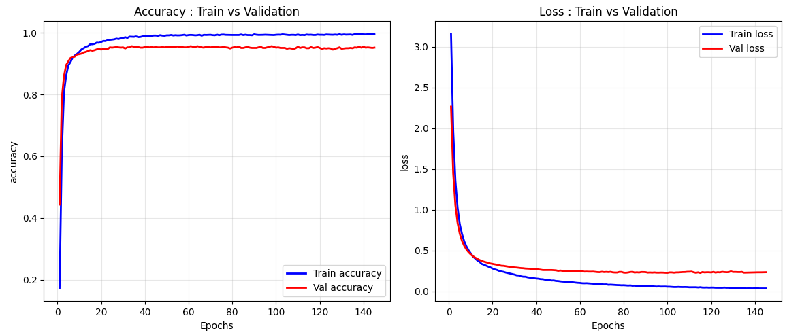

<p align="center">
  
</p>

<h1 align="center">🧪 Entraînement du classifieur DINOv2 – Notebook</h1>

<p align="center">
  <strong>Notebook Jupyter pour l'extraction de caractéristiques DINOv2 et l'entraînement d'un classifieur sur des déchets marins</strong>
</p>

<p align="center">
  <a href="#"></a>
  <a href="#"></a>
  <a href="#"></a>
  <a href="#"></a>
</p>

<p align="center">
  <a href="https://www.linkedin.com/in/soirfane-abdallah-houmadi-7576a32a6/">
    
  </a>
  <a href="mailto:soirfaneabdallahhoumadi863@gmail.com">
    
  </a>
</p>

---

## 📋 Table des matières

- [À propos](#-à-propos)
- [Jeu de données](#-jeu-de-données)
- [Visualisation des données et courbes d'apprentissage](#-visualisation-des-données-et-courbes-dapprentissage)
- [Fonctionnalités](#-fonctionnalités)
- [Prérequis](#-prérequis)
- [Installation et exécution](#-installation-et-exécution)
- [Utilisation du notebook](#-utilisation-du-notebook)
- [Licence](#-licence)
- [Contact](#-contact)

---

## 📖 À propos

Ce notebook Jupyter implémente un pipeline complet de classification d'images de déchets marins (ou de poissons) en utilisant **DINOv2** comme extracteur de caractéristiques. Il repose sur l'utilisation conjointe de **PyTorch** (pour le chargement du modèle DINOv2) et de **TensorFlow/Keras** (pour l'entraînement du classifieur).

Le workflow est le suivant :

1. **Chargement du jeu de données** (via une fonction utilitaire `Load_data.load_object`).
2. **Extraction des embeddings** DINOv2 (taille 384) sur les images d'entraînement et de test.
3. **Construction d'un classifieur** à couches denses avec régularisation, batch normalisation et dropout.
4. **Entraînement supervisé** avec prise en compte du déséquilibre des classes (poids de classe).
5. **Évaluation** avec matrice de confusion, rapport de classification et F1-score.
6. **Sauvegarde du meilleur modèle** (via `ModelCheckpoint`) et arrêt précoce (`EarlyStopping`).

---

## 📊 Jeu de données

Ce projet s'appuie sur un jeu de données personnalisé d'images de **déchets marins** et de **poissons de récif**, soigneusement annoté pour l'entraînement du classifieur.

> 📌 **Ce jeu de données est désormais disponible sur demande.**
> Pour y accéder, veuillez nous contacter à l'adresse email fournie dans la section [Contact](#-contact). Nous vous fournirons :
> - Un lien de téléchargement sécurisé (archive ZIP)
> - La description détaillée des classes (28 espèces de poissons et 5 types de déchets)
> - Les conditions d'utilisation et de citation

**Pourquoi une demande ?**
Ce jeu de données est le fruit d'un travail de collecte et d'annotation rigoureux. Nous souhaitons suivre ses usages et constituer une communauté scientifique autour de la biodiversité marine.

---

## 📸 Visualisation des données et courbes d'apprentissage

| Exemples d'images du jeu de données | Courbes d'apprentissage (Loss & Accuracy) |
|:---:|:---:|
|  |  |

> **Remarque** :
> - La **grille d'images** vous permet de visualiser la diversité et la qualité des données d'entraînement (déchets marins ou poissons).
> - Les **courbes d'apprentissage** sont automatiquement générées par la fonction `plot_result` du notebook. Elles tracent l'évolution de la loss et de l'accuracy en entraînement et en validation, et sont sauvegardées dans le dossier `training_results/`.

---

## ✨ Fonctionnalités

| Étape | Description |
| :--- | :--- |
| **Extraction d'embeddings** | Utilisation de `facebook/dinov2-small` avec le token [CLS] pour obtenir un vecteur de 384 dimensions. |
| **Classifieur personnalisé** | Architecture dense avec `[128]` neurones (configurable), régularisation L2, BN, Dropout. |
| **Gestion des classes déséquilibrées** | Calcul automatique des poids de classe via `sklearn.utils.class_weight`. |
| **Callbacks avancés** | `ModelCheckpoint` (sauvegarde du meilleur modèle), `EarlyStopping` (patience 30), `ReduceLROnPlateau` (réduction du LR). |
| **Évaluation complète** | Matrice de confusion normalisée, rapport de classification, F1 macro et pondéré. |
| **Tracé des courbes d'apprentissage** | Graphiques des métriques d'entraînement/validation sur toutes les époques. |

---

## 📋 Prérequis

Avant d'exécuter le notebook, assurez-vous d'avoir installé les dépendances suivantes :

- Python 3.9 ou supérieur
- TensorFlow (>= 2.8)
- PyTorch (>= 1.10)
- Transformers (>= 4.20)
- scikit-learn
- pandas, numpy, matplotlib, seaborn
- tqdm
- jupyter / jupyterlab

> **Note** : Le notebook importe un module personnalisé `outils` qui contient la fonction `Load_data.load_object`. Ce module n'est pas fourni ; vous devez le créer ou adapter le chargement des données selon votre propre structure.

---

## 🚀 Installation et exécution

### 1. Cloner le dépôt (ou récupérer le notebook)

```bash
git clone https://github.com/votre-username/vision-lab-dinov2-training.git
cd vision-lab-dinov2-training
```

### 2. Créer un environnement virtuel

```bash
python -m venv venv
venv\Scripts\activate      # Windows
source venv/bin/activate   # macOS / Linux
```

### 3. Installer les dépendances

```bash
pip install -r requirements.txt
```

### 4. Lancer Jupyter

```bash
jupyter lab
```

Ouvrez ensuite le notebook principal et exécutez les cellules dans l'ordre.

---

## 🖱️ Utilisation du notebook

1. Placez votre jeu de données au format attendu par `Load_data.load_object` (voir la section [Jeu de données](#-jeu-de-données)), ou adaptez le chargement à votre propre structure.
2. Exécutez les cellules d'extraction d'embeddings DINOv2 — ce calcul peut être accéléré par GPU (CUDA) s'il est disponible.
3. Ajustez si besoin l'architecture du classifieur (nombre de couches, neurones, dropout) dans la cellule de configuration.
4. Lancez l'entraînement : les callbacks (`ModelCheckpoint`, `EarlyStopping`, `ReduceLROnPlateau`) gèrent automatiquement la sauvegarde du meilleur modèle et l'arrêt anticipé.
5. Consultez les résultats dans `training_results/` : courbes d'apprentissage, matrice de confusion, rapport de classification.

---

## 📄 Licence

Ce projet est distribué sous licence **MIT**. Voir le fichier `LICENSE` pour plus de détails.

---

## 📬 Contact

**Soirfane Abdallah Houmadi**

[](https://www.linkedin.com/in/soirfane-abdallah-houmadi-7576a32a6/)
[](mailto:soirfaneabdallahhoumadi863@gmail.com)

Pour toute demande d'accès au jeu de données, question sur le pipeline d'entraînement, ou opportunité de collaboration, n'hésitez pas à me contacter.

<p align="center">Fait avec 🐠 et Python</p>